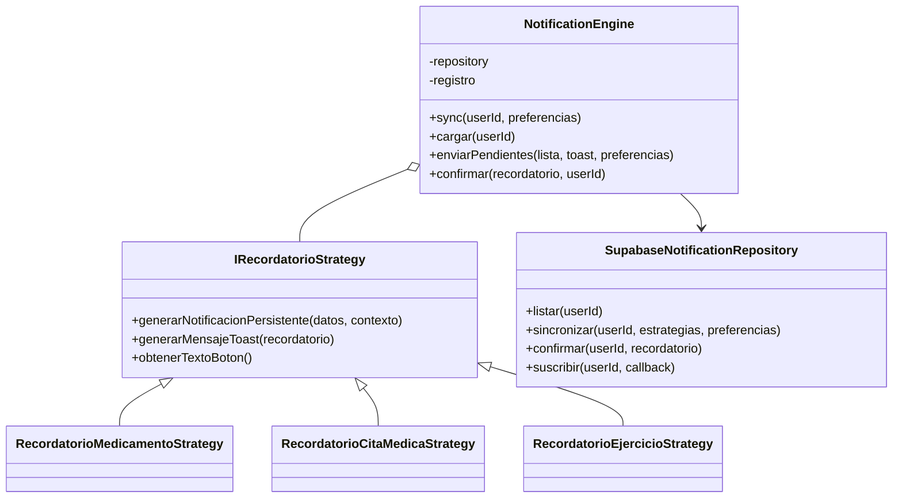
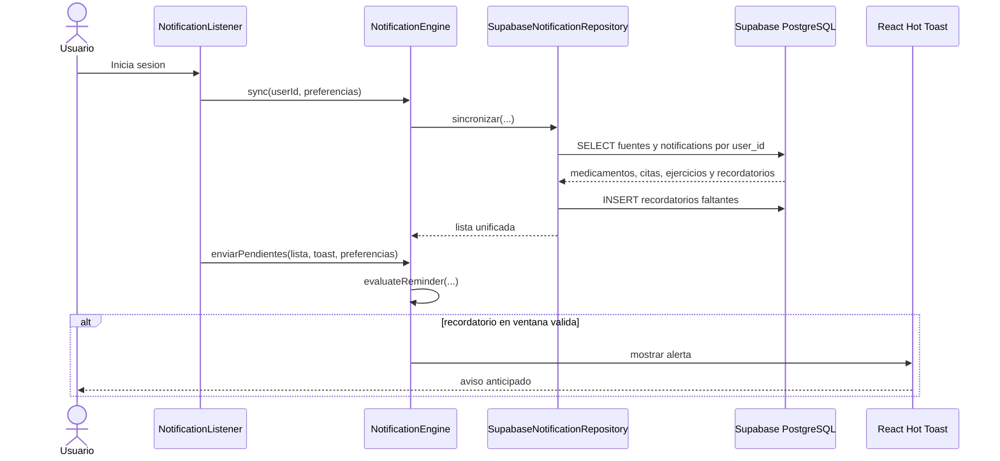
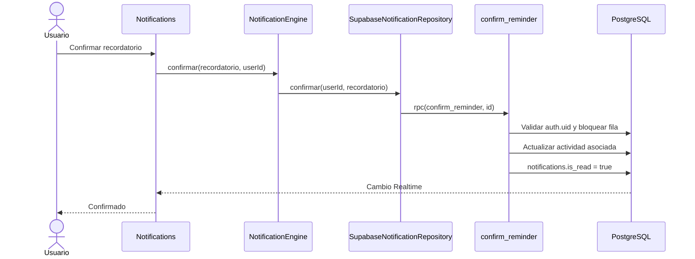

# Release 2 - Modulo de Recordatorios

## Alcance y trazabilidad

| Historia | Implementacion | Evidencia principal |
| --- | --- | --- |
| US-050 | Vista unificada de medicamentos, citas y ejercicios, campana con pendientes e historial. | `Notifications.jsx`, `DashboardMenu.jsx` |
| US-051 | Confirmacion del recordatorio y actualizacion de la actividad asociada en una operacion de base de datos. | `SupabaseNotificationRepository.js`, RPC `confirm_reminder` |
| US-052 | Persistencia en `notifications`, sincronizacion Realtime, anticipacion por tipo y horario silencioso. | `NotificationListener.jsx`, estrategias, `ReminderPreferences.jsx` |

No se usa `localStorage` para recordatorios, preferencias, medicamentos ni ejercicios. Las preferencias se almacenan en `auth.users.user_metadata.reminder_preferences`; los recordatorios y el estado de sus actividades se almacenan en tablas publicas protegidas por RLS.

## Criterios de aceptacion verificables

### US-050

1. Dado un usuario autenticado, cuando abre Recordatorios, solo ve registros asociados a su `user_id`.
2. La vista muestra medicamentos, citas medicas y ejercicios en un unico espacio.
3. Los pendientes aparecen primero y los confirmados permanecen en el historial.
4. La campana del encabezado indica si existen actividades pendientes.

### US-051

1. Al confirmar un medicamento, `medicines.is_taken` cambia a `true`.
2. Al confirmar una cita, `appointments.is_completed` cambia a `true`.
3. Al confirmar un ejercicio, `exercises.is_completed` cambia a `true`.
4. En todos los casos, `notifications.is_read` cambia a `true`.
5. La funcion SQL valida que el recordatorio pertenezca al usuario autenticado.

### US-052

1. Los recordatorios se insertan en `public.notifications` y no en almacenamiento local.
2. La anticipacion se puede configurar por tipo entre 0 y 1440 minutos.
3. El motor comprueba alertas al iniciar, cada 60 segundos y ante cambios Realtime.
4. Una alerta solo se muestra durante la ventana valida de diez minutos.
5. El horario silencioso evita interrupciones.
6. La configuracion se conserva entre dispositivos en los metadatos de Supabase Auth.

## Arquitectura orientada a objetos

Se mantiene el patron Strategy. `NotificationEngine` orquesta abstracciones, el repositorio aisla Supabase y cada estrategia transforma su fuente en un recordatorio persistible.



### Secuencia de sincronizacion y alerta



### Secuencia de confirmacion



## Prueba de Caja Blanca

Unidad: `evaluateReminder(recordatorio, preferences, now)` en `reminderRules.js`.

Complejidad ciclomatica: siete decisiones independientes mas el camino base, por lo tanto `V(G) = 7 + 1 = 8`, mayor a 4.

| Camino | Condicion recorrida | Resultado esperado |
| --- | --- | --- |
| P1 | Preferencias desactivadas | `disabled` |
| P2 | Recordatorio inactivo | `inactive` |
| P3 | Recordatorio confirmado | `confirmed` |
| P4 | Fecha invalida | `invalid-date` |
| P5 | Horario silencioso | `quiet-hours` |
| P6 | Alerta futura | `upcoming` |
| P7 | Ventana expirada | `expired` |
| P8 | Ventana valida | `due`, notificar |

Archivo: `tests/Recordatorios/ReminderRules.whitebox.test.js`.

## Prueba de Caja Negra

Funcionalidad: guardar preferencias de recordatorios. Entradas observables:

1. Activar alertas.
2. Anticipacion para medicamentos.
3. Anticipacion para citas.
4. Anticipacion para ejercicios.
5. Inicio del horario silencioso.
6. Fin del horario silencioso.

| Caso | Particion | Datos | Salida esperada |
| --- | --- | --- | --- |
| CN-01 | Valida | 15, 60, 20, 22:00, 07:00, activo | Guarda en Supabase |
| CN-02 | Invalida superior | 1441 minutos | Muestra error y no guarda |
| CN-03 | Valores limite | 0 y 1440 minutos | Guarda correctamente |
| CN-Browser | Navegador real | Seis campos validos | Chromium acepta y conserva entradas |

Archivos: `ReminderPreferences.blackbox.test.jsx` y `ReminderPreferences.browser.test.jsx`.

## Prueba Unitaria

Metodo: `calculateNextMedicineTake(startValue, frequency, now)`.

Casos cubiertos: toma futura, cada 8 horas, cada 12 horas, frecuencia diaria, fecha invalida y frecuencia desconocida. Se supera el minimo de cuatro casos solicitado.

Archivo: `tests/Recordatorios/CalculateNextMedicineTake.unit.test.js`.

## Ejecucion

```powershell
npm install
npm run test:run
npm run test:browser
npm run build
```

Antes de la demostracion, ejecutar `supabase/recordatorios_release2.sql` una sola vez en Supabase SQL Editor. El script crea las politicas RLS, la funcion transaccional de confirmacion, la columna de estado de citas y la publicacion Realtime.

## Historia adicional recomendada

Se recomienda registrar en el backlog:

**US-053:** Como usuario quiero personalizar la anticipacion y el horario silencioso de mis recordatorios para recibir alertas oportunas sin interrupciones.

Puede integrarse sin cambiar la arquitectura actual y formaliza la funcionalidad utilizada en la prueba de Caja Negra.
